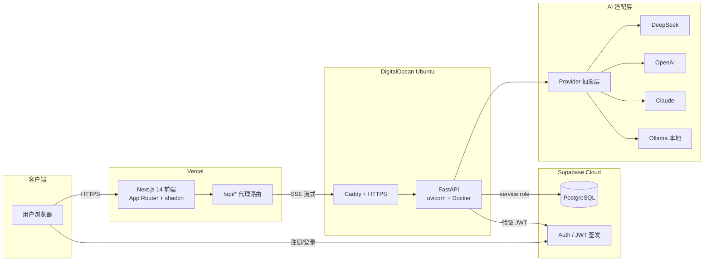

# SecMate 设计与需求文档（v0.1 已确认）

> 状态：2026-09-05 用户确认进入阶段2。本文档为后续所有开发阶段的唯一需求来源。

## 0. 关键决策（已确认）

| # | 决策点 | 决策 |
|---|--------|------|
| A | 目标市场 | 国内市场、中文界面为主，SEO 双语兼顾 |
| B | 默认 AI | DeepSeek（OpenAI 兼容格式），适配层可换 OpenAI/Claude/Ollama |
| C | 支付 | 预留抽象层，优先国内聚合支付（PayJS/虎皮椒），Stripe 留接口 |
| D | 认证 | Supabase Auth（JWT），FastAPI 侧验签 |

## 1. 产品定位

> **SecMate 把"看不懂的报错、请求、命令、CTF 题目"变成"讲得清原理、给得出方向、指得明练习环境"的学习材料。**

目标用户：信息安全专业学生、CTF 初学者、转行学习者、计算机专业学生。

**合规与安全红线（写入所有 Prompt 与文案）：**

1. 只做教育解释，不提供针对真实目标的攻击步骤；
2. 实操建议只指向授权环境：DVWA、PortSwigger Web Security Academy、HackTheBox Academy、TryHackMe、BUUCTF、本地 Docker 靶场等；
3. 输入侧敏感信息检测，提示用户勿粘贴生产环境真实凭据；
4. 分析结果底部固定免责声明与"仅限授权环境学习"提示。

## 2. 功能全景

| 优先级 | 阶段 | 功能 |
|--------|------|------|
| P0 | 阶段3 MVP | 匿名分析（输入框+分析按钮）、Markdown 流式渲染（代码高亮）、6 类输入自动识别、暗色模式、免责声明、IP 限流 |
| P1 | 阶段4 商业化 | 注册/登录、JWT 认证、Free 5 次/天 / Pro 无限、配额看板、升级引导页、支付接口预留 |
| P2 | 阶段5 优化 | 历史记录、收藏、公开分享、Prompt 后台管理、SEO（SSR/OG/sitemap）、网站统计（Umami）、输入脱敏存储 |

**AI 输出七段式规范**（写入系统提示词）：1. 问题分析 2. 技术原理解释 3. 学习方向 4. 排查思路 5. 修复建议 6. 相关知识点 7. 推荐练习环境。

CTF 场景默认"思路引导"模式（不给直接答案），可切换"讲解模式"。

## 3. 商业化设计

- **免费获客**：SEO 长尾知识卡片页、每日 5 次免费完整体验、分享传播、内容营销（公众号/小红书/B站）、GitHub 开源引流。
- **付费理由**：频次刚需（期末/备赛期 5 次/天不够）、更强模型、历史无限、学习笔记整理、优先队列。
- **定价**：Free ¥0（5 次/天）；Pro ¥19/月；年付 ¥168/年；学生 Pro ¥9.9/月（edu 验证）；3 天免费试用；Pro 合理使用上限 200 次/天。
- **增长**：免费工具页引流（HTTP 请求解析器、SQL 注入学习卡、CTF 术语词典）、邀请奖励（双方 3 天 Pro）、校园大使、CTF 社区合作。
- **SEO 关键词**：中文 `CTF入门 / CTF web题 / SQL注入原理 / XSS漏洞讲解 / HTTP请求分析 / 渗透测试学习 / 网络安全学习路线 / DVWA教程`；英文 `CTF for beginners / web security tutorial / SQL injection explained / learn ethical hacking / HTTP request analyzer`。
- **GitHub 开源**：前后端全开源 MIT，Prompt 模板开源共建；"自部署免费，云端省心"；API key 与运营数据不入库。

## 4. 成功指标（MVP 上线 30 天）

北极星：每周完成分析数 1000 次；周活 200；7 日留存 25%；Free→Pro 转化 3-5%。

## 5. MVP 功能列表（验收标准）

| # | 功能 | 验收标准 |
|---|------|----------|
| M1 | 首页 | Logo SecMate、英文标题、"开始分析"按钮、特性区、示例卡；响应式+暗色模式 |
| M2 | 分析页 | 输入框（≥8000 字符）、类型自动识别、流式 Markdown、代码高亮、复制/导出 |
| M3 | 分析 API | `POST /api/v1/analysis`（SSE 流式），七段式输出，超时与错误处理 |
| M4 | AI 适配层 | Provider 抽象，DeepSeek 跑通；换环境变量可切 OpenAI/Claude/Ollama |
| M5 | 安全护栏 | 系统提示词强制教育框架；攻击真实目标类输入礼貌拒绝；免责声明 |
| M6 | 限流 | IP 级限流，超限返回 429 |
| M7 | 记录落库 | 匿名分析记录存入 `analyses` 表 |
| M8 | 部署 | Vercel + DigitalOcean 上线，HTTPS 可用 |

**MVP 明确不做**：登录、支付、历史页、收藏、分享、i18n。

## 6. 技术架构

**关键决策**：前端代理后端（隐藏后端地址、统一 CORS）；SSE 逐 token 流式（首 token < 2s）；AI 适配层统一 `stream_chat` 接口；MVP 不引入 Redis/消息队列。

## 7. 数据库设计

7 张表：`profiles`（关联 auth.users，触发器自动建档）、`analyses`、`daily_usage`（联合主键原子计数）、`subscriptions`、`orders`（支付预留）、`prompts`、`shared_links`。全部启用 RLS，阶段4 细化策略。详见 `database/schema.sql`。

## 8. 安全设计

输入长度限制（8k）、敏感信息正则检测；系统提示词强制教育框架；Supabase JWT 验签 + Free 配额 + IP 限流；密钥全走环境变量；日志不落输入内容。

## 9. 部署与成本

Vercel Hobby（¥0）+ DO 最低配（≈¥43/月）+ Supabase Free（¥0）+ DeepSeek 按量（每次约 ¥0.005-0.02）。**MVP 固定成本 ≈ ¥50/月**。

## 10. 30 天路线图

- W1 (D1-7)：阶段1+2 需求冻结、git init、前后端脚手架、DB schema、AI 适配层、首次联调
- W2 (D8-14)：阶段3 MVP 首页/分析页 UI、分析 API、流式渲染、类型识别、限流
- W3 (D15-21)：部署 Vercel+DO、HTTPS、安全护栏、响应式/暗色打磨
- W4 (D22-28)：阶段4 商业化 Auth、配额、会员、支付预留
- D29-30：缓冲、文档、复盘、阶段5 规划

逐日明细见 `docs/superpowers/plans/` 下各阶段实施计划。
