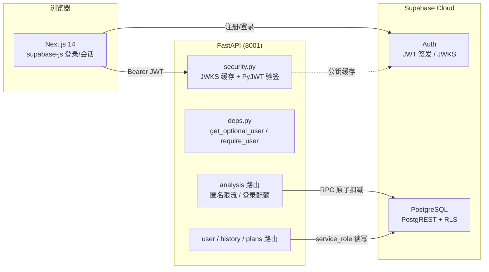

# SecMate 阶段4 商业化设计文档

> 状态：2026-09-05 设计三节已获用户确认。本文档是阶段4（商业化）的唯一实施依据，与 `2026-09-05-secmate-design.md` 的关系：后者为总纲，本文档为阶段4 细化。

## 0. 已锁定决策

| # | 决策点 | 决策 |
|---|--------|------|
| 1 | 匿名策略 | 保留匿名分析（IP 限流 10 次/分兜底），登录解锁个人配额（Free 5 次/天）与历史记录 |
| 2 | 登录方式 | Supabase Auth：邮箱+密码 + GitHub OAuth（JWT 由 Supabase 签发，后端本地验签） |
| 3 | 支付范围 | 纯预留：定价/升级页 + 订单/订阅表（已具备）+ 支付接口抽象预留；升级按钮显示「即将上线」，不接真实支付 |
| 4 | Pro 权益 | 配额（Free 5 次/天 vs Pro 200 次/天上限）+ 分析历史列表（登录用户），历史从阶段5 提前到本阶段 |
| 5 | 认证架构 | 方案 A：后端本地验证 JWT（RS256 走 JWKS 缓存 / HS256 走 JWT_SECRET），每请求零外部调用 |

**设计细化（与第 1 节展示的差异）**：数据访问统一走 PostgREST（httpx + service_role，与现有 `recorder.py` 一致），不再引入 psycopg 直连。配额原子扣减通过新增 Postgres RPC 函数实现（单条 SQL 原子完成"检查+扣减"）。

## 1. 范围

**做**：注册/登录（邮箱+密码、GitHub OAuth 按钮）、JWT 后端验签、Free 5 次/天个人配额（原子扣减）、Pro 200 次/天上限代码路径、header 配额徽章、升级引导卡片、定价页（支付预留）、分析历史列表+详情、supabase-js 前端接入。

**不做**：真实支付接入、学生 edu 验证逻辑（仅定价页展示价格）、3 天试用激活、共享链接、prompts 后台管理、@supabase/ssr 的 cookie 会话方案（应用为客户端交互型，localStorage session 足够）、Supabase local dev 模拟、自定义密码找回页面（使用 Supabase 默认邮件模板）。

## 2. 架构



- 登录用户请求带 `Authorization: Bearer <JWT>`；后端本地验签（RS256：JWKS 缓存 TTL 24h、kid 未命中自动刷新；HS256：`SUPABASE_JWT_SECRET`），验证 `aud=authenticated`、`iss={SUPABASE_URL}/auth/v1`、`exp`。
- Supabase 未配置时后端整体退化为阶段3 匿名模式（现有"本地可无库运行"能力保留）。
- 前端所有后端访问走 Next.js 代理（隐藏后端地址、统一 CORS）。

## 3. 数据库变更

表结构**无需改动**（`database/schema.sql` 已具备 profiles/analyses/daily_usage/subscriptions/orders 及 RLS）。新增一个 RPC 函数，追加到 `database/schema.sql` 末尾：

```sql
-- 原子配额扣减：未超限则 +1 并返回新计数；已超限返回空结果（PostgREST 收空数组）
create or replace function public.check_and_increment_usage(p_user_id uuid, p_limit int)
returns int
language sql
security definer set search_path = public
as $$
  insert into public.daily_usage (user_id, usage_date, count)
  values (p_user_id, current_date, 1)
  on conflict (user_id, usage_date)
  do update set count = public.daily_usage.count + 1
  where public.daily_usage.count < p_limit
  returning count;
$$;
grant execute on function public.check_and_increment_usage(uuid, int) to service_role;
```

已执行过 schema.sql 的 Supabase 项目只需单独执行以上函数语句。

**套餐解析规则**：`profiles.plan`（默认 free）为快速路径；plan=pro 时校验 `subscriptions` 存在 status=active 且 expires_at 未过期，否则按 free 计。本阶段无支付，所有用户实际为 free，但解析代码路径完整实现。

## 4. 后端设计

### 4.1 模块

| 模块 | 状态 | 职责 |
|---|---|---|
| `app/core/config.py` | 改 | 新增 `supabase_jwt_secret: str = ""` |
| `app/core/security.py` | 新 | JWKS 拉取+缓存（TTL 24h、失败/kid 未命中自动刷新）、`verify_supabase_token()` 支持 RS256/HS256，校验 aud/iss/exp |
| `app/api/deps.py` | 新 | `get_optional_user`（无 token/未配置 Supabase 时返回 None，验签失败抛 401）、`require_user`（强制） |
| `app/services/supabase_rest.py` | 新 | PostgREST 通用请求封装（service_role 头、可注入 http_client 供测试，模式同 recorder） |
| `app/services/plans.py` | 新 | `PLAN_LIMITS = {"free": 5, "pro": 200}`、定价配置（供 /plans） |
| `app/services/usage.py` | 新 | `check_and_increment(user_id, limit)`（调 RPC，空结果=超限）、`get_usage(user_id)`、`resolve_plan(user_id)` |
| `app/services/recorder.py` | 改 | `record_analysis(..., user_id=None)` 支持登录用户落库 |
| `app/api/routes/analysis.py` | 改 | 见 4.3 |
| `app/api/routes/user.py` | 新 | `GET /api/v1/user/profile` |
| `app/api/routes/history.py` | 新 | `GET /api/v1/history`、`GET /api/v1/history/{id}` |
| `app/api/routes/plans.py` | 新 | `GET /api/v1/plans` |

依赖新增：`pyjwt[crypto]`。无数据库驱动依赖。

### 4.2 API 一览

| 端点 | 认证 | 说明 |
|---|---|---|
| `GET /api/v1/plans` | 无 | 定价配置（前端定价页消费，单一数据源） |
| `GET /api/v1/user/profile` | 必须 | 返回 `{email, plan, used_today, limit, remaining}` |
| `GET /api/v1/history?page=&page_size=` | 必须 | 本人分析记录分页（时间倒序，含 input_type/input_text 摘要/tokens_out/created_at） |
| `GET /api/v1/history/{id}` | 必须 | 单条详情（校验归属，非本人 404） |
| `POST /api/v1/analysis` | 可选 | 见 4.3 |

### 4.3 analyze 路由改造

```
请求 → 取 Authorization 头 → get_optional_user
  ├─ 登录用户：跳过 IP 限流 → resolve_plan → check_and_increment(user_id, limit)
  │     ├─ 超限 → 429 {"code": "quota_exceeded", "message": "今日免费额度已用完…"}（JSON，流开始前）
  │     └─ 未超限 → 流式（协议不变）→ 结束写 analyses（带 user_id）
  └─ 匿名：现有逻辑完全不变（IP 限流 → safety → 分类 → 流式 → 匿名落库）
```

- 配额在**流开始前原子扣减**，防流中断白嫖；扣减后流失败不退回（简单可接受）。
- 认证与配额检查失败发生在 SSE 开始前，走现有 JSON 错误格式 `{"detail": {code, message}}`；流开始后的异常仍走 `event: error`（现状不变）。
- Supabase 可用性：认证/配额/历史路径依赖 Supabase，失败返回 503（前端提示稍后重试）；匿名分析路径不依赖 Supabase（仅落库静默失败），降级可用。

## 5. 前端设计

### 5.1 依赖与基础设施

- 新增 `@supabase/supabase-js`；`src/lib/supabase.ts` 创建客户端单例（`NEXT_PUBLIC_SUPABASE_URL` / `NEXT_PUBLIC_SUPABASE_ANON_KEY`）。
- `src/lib/auth.tsx`：AuthProvider（session 状态、`onAuthStateChange` 订阅、signIn/signUp/signOut、loading 态），layout 挂载。
- `src/lib/api.ts`：新增 `getAuthHeaders()`；`streamAnalysis` 带 Bearer；历史/profile/plans 的 fetch 封装。
- **新增通用代理** `src/app/api/[...path]/route.ts`：GET-only，把 `/api/plans`、`/api/user/profile`、`/api/history*` 透传到 `{BACKEND_API_URL}/api/v1/{path}`，透传 Authorization 与 X-Forwarded-For。静态路由 `/api/analyze/route.ts` 优先于 catch-all，不受影响。
- `/api/analyze/route.ts` 修改：透传 `Authorization` 头。

### 5.2 页面与组件

| 文件 | 说明 |
|---|---|
| `src/components/user-menu.tsx` | header 右侧：未登录=「登录」按钮；已登录=邮箱 + 「今日剩余 N 次」徽章 + 下拉（分析历史/定价/退出） |
| `src/components/quota-badge.tsx` | 剩余次数徽章（挂载时 + 分析完成后刷新，调 /api/user/profile） |
| `src/components/upgrade-card.tsx` | 升级引导卡片（「今日额度已用完」+ 查看 Pro 定价跳 /pricing） |
| `src/app/login/page.tsx` | 登录/注册页：邮箱+密码、GitHub OAuth 按钮、登录/注册切换，沿用 tech/security 视觉 |
| `src/app/history/page.tsx` | 历史列表：时间、类型徽章、输入摘要；未登录重定向 /login；分页 |
| `src/app/history/[id]/page.tsx` | 详情：完整问答 Markdown 渲染（复用 Markdown 组件）+ 复制/导出 |
| `src/app/pricing/page.tsx` | 定价页：Free ¥0 / Pro ¥19/月 / 年付 ¥168 / 学生 ¥9.9 四卡，升级按钮「即将上线」；数据来自 GET /api/plans |
| `src/components/site-header.tsx` | 改：集成 UserMenu |
| `src/components/analyze-client.tsx` | 改：`quota_exceeded` 错误分支渲染 UpgradeCard |

### 5.3 关键交互流

1. **登录**：邮箱+密码/GitHub → supabase.auth 签发 JWT → localStorage 会话 → 后续请求自动带 Bearer。
2. **分析（登录）**：超限收到 429 `quota_exceeded` → 结果区 UpgradeCard；正常流式无感知，`done` 事件后刷新配额徽章。
3. **GitHub OAuth**：按钮完整实现 `signInWithOAuth({provider:'github'})`；若 Supabase 项目未配置 GitHub provider 则 Supabase 返回错误，前端提示「该登录方式未配置」。验收以邮箱登录为准。
4. **退出**：清除会话 → header 回「登录」态 → 分析功能降级匿名（IP 限流兜底）。

## 6. 错误处理矩阵

| 场景 | 后端 | 前端 |
|---|---|---|
| JWT 无效/过期 | 401 `invalid_token` | 清除会话，提示「登录已过期」跳 /login |
| 配额耗尽（登录） | 429 `quota_exceeded` | UpgradeCard + 跳 /pricing |
| 匿名限流 | 429 `rate_limited`（现状） | 现有提示不变 |
| Supabase 不可用 | 认证/配额/历史 503 | 提示稍后重试；匿名分析不受影响 |
| 历史写入失败（流已结束） | 记日志，不影响已返回结果 | 无感知 |
| 历史详情非本人 | 404 | 「记录不存在」 |

## 7. 测试策略

- **后端单元测试**（不依赖真实 Supabase）：
  - `security.py`：本地签发 HS256 token 验证通过/篡改/过期/aud 错误；RS256 用固定测试 JWKS + MockTransport 注入
  - `usage.py`：RPC 返回 `[6]`=成功、空数组=超限两分支；`resolve_plan` 分支
  - analyze 认证分支：override `get_optional_user` 模拟匿名/登录/超限三场景
  - 现有 57 个测试全部保持通过（匿名路径不破坏）
- **集成测试**（需真实 Supabase 项目，Playwright E2E）：注册→登录→连续 5 次分析→第 6 次出现 UpgradeCard→历史列表 5 条→详情可看→退出回匿名。
- **前端**：`npm run build` + lint 零错误；E2E 覆盖登录页、配额徽章、升级卡片。
- **回归**：`pytest`（backend）、`npm run build`（frontend）为完成验收的最低门槛。

## 8. 实施前置条件（需要用户提供）

1. 创建免费 Supabase 项目（supabase.com），提供：`SUPABASE_URL`、`SUPABASE_ANON_KEY`、`SUPABASE_SERVICE_ROLE_KEY`、`SUPABASE_JWT_SECRET`（Dashboard → Settings → API）。
2. 在 Supabase SQL Editor 执行 `database/schema.sql`（若之前执行过，仅需执行 3 节的 RPC 函数）。
3. Auth providers：启用 Email；GitHub OAuth 可选（需自建 GitHub OAuth App，可后补）。
4. 密钥填入 `backend/.env`（SUPABASE_URL / SUPABASE_SERVICE_ROLE_KEY / SUPABASE_JWT_SECRET）与 `frontend/.env.local`（NEXT_PUBLIC_SUPABASE_URL / NEXT_PUBLIC_SUPABASE_ANON_KEY），均不入库。
5. 未提供前：后端保持匿名模式可运行，所有既有测试照常通过；登录相关功能与集成测试等待密钥后验收。

## 9. 验收标准（阶段4 完成定义）

1. 匿名路径行为与阶段3 完全一致（回归通过）。
2. 邮箱注册→登录→5 次分析→第 6 次被拒且出现升级引导。
3. 配额徽章实时正确（扣减即刷新）。
4. 历史列表/详情仅本人可见。
5. 定价页四卡展示正确，升级按钮「即将上线」。
6. 后端 pytest 全绿（含新增单测）；前端 build + lint 零错误；E2E 集成链路通过。
